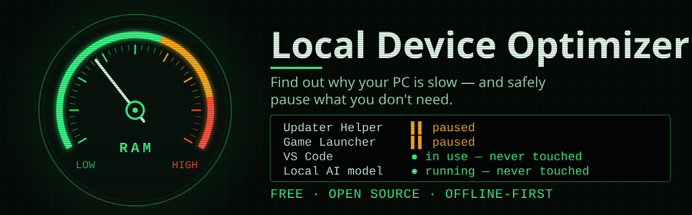
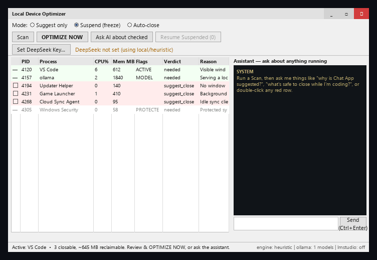
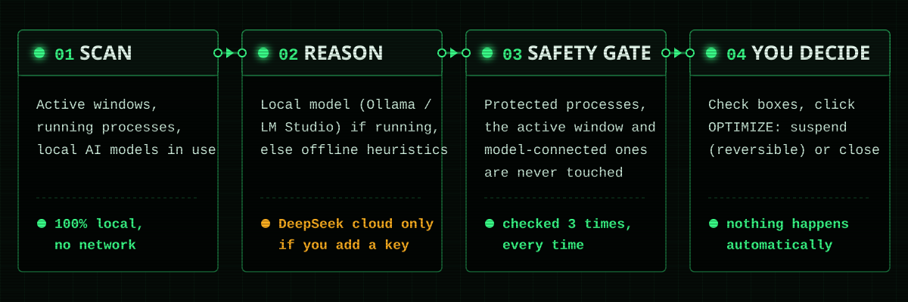
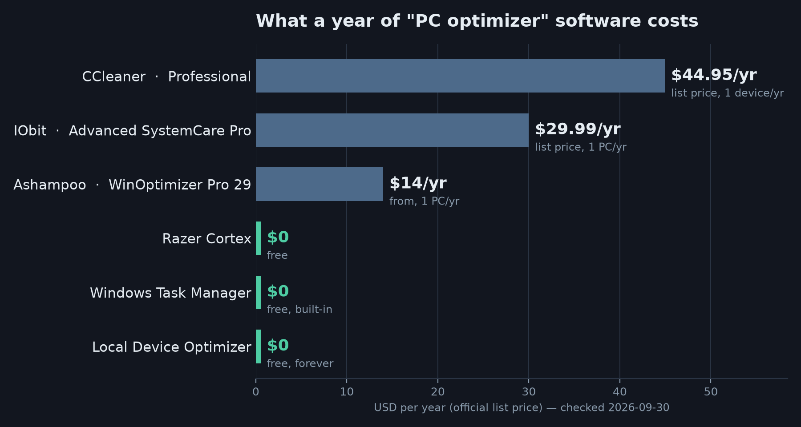

<p align="center">
  
</p>

<p align="center">
  <a href="https://github.com/awesomo913/Optimizer/releases/latest"></a>
  <a href="https://github.com/awesomo913/Optimizer/releases"></a>
  <a href="LICENSE"></a>
  
  <a href="https://github.com/awesomo913/Optimizer/actions/workflows/ci.yml"></a>
  
</p>

<p align="center"><b>Find out why your PC is slow and safely pause what you don't need — free, offline-first, open source.</b></p>

<p align="center">
  <a href="https://github.com/awesomo913/Optimizer/releases/latest"><b>⬇ Download for Windows</b></a>
</p>

<p align="center">
  
</p>

## Why Local Device Optimizer

- **Nothing is closed without you clicking it.** Default mode only suggests. Suspend (reversible) or Auto-close only run after you check specific rows, click OPTIMIZE NOW, and confirm a dialog that names the exact processes involved.
- **Three independent safety nets.** Protected Windows/security processes, anything with a visible window, and anything connected to a local AI model can never be closed or suspended — the check runs three separate times, and it's covered by automated tests, not just a comment.
- **Reversible by default.** Suspended processes freeze instead of dying — hit **Resume Suspended** any time to bring them back exactly where they left off.
- **Offline by default.** Decisions come from a local AI model (Ollama/LM Studio) if one is running, or built-in heuristics if not. No account, no cloud call, no telemetry — unless you explicitly opt in below.
- **Cloud reasoning is opt-in, not default.** Add a DeepSeek API key only if you want it; the app tells you exactly what that sends (process names and window titles) right next to the key field.
- **Free and open source.** MIT licensed. No paywall, no upsell.

## Quick start

1. **[Download the latest release](https://github.com/awesomo913/Optimizer/releases/latest)** and run `OptimizerGUI.exe`, or [build from source](#build-from-source).
2. Click **Scan**. Rows the optimizer thinks you can live without turn up red with a one-line reason.
3. Check the ones you agree with (or trust the auto-checked high-confidence ones), pick **Suspend** or **Auto-close**, and click **OPTIMIZE NOW**.
4. Changed your mind? Click **Resume Suspended** to bring everything back.

## How it works

<p align="center">
  
</p>

1. **Scan** — reads your active windows (via `ctypes`, no extra dependency), every running process, and which programs are talking to a local AI model server.
2. **Reason** — DeepSeek (only if you've set a key) → a local model (Ollama/LM Studio, if running) → built-in heuristics. All three return the same shape, so the app doesn't care which one answered.
3. **Safety gate** — protected, active-window, and model-connected processes are forced back to "needed" no matter what the reasoner said, and the apply step refuses to touch them again, and the actual kill/suspend call checks a third time right before acting.
4. **You decide** — nothing happens until you check rows, pick a mode, and confirm a dialog naming exactly what's about to change.

## Staying safe

A tool that can close processes is only as good as its brakes. There are three, and a process has to clear all of them before it's touched:

1. **Safety override** — protected processes are forced to "keep" regardless of what any reasoner says (`analyzer._apply_safety_overrides`).
2. **Apply-time gate** — `apply_action` refuses any pid that's protected, tied to an active window, or connected to a local model.
3. **Action-time gate** — `processes.kill` / `processes.suspend` re-check the protected list at the instant they act, so nothing slips through a stale recommendation.

The protected list (`config.PROTECTED_NAMES`) covers the Windows kernel and session stack (`csrss`, `wininit`, `lsass`, `dwm`, `explorer`, …), security/AV (`MsMpEng`, Defender, SmartScreen), the local-model runners (Ollama / LM Studio), and the optimizer's own Python runtime — so it can't kill itself. All three gates are pinned by automated tests in `tests/test_safety.py`, `tests/test_analyzer.py`, and `tests/test_processes.py` — see [SECURITY.md](SECURITY.md) for the full scope notes, including exactly what the DeepSeek option sends if you turn it on.

## Choosing a reasoner

Engines are tried in order, all returning the same shape so the analyzer doesn't care which answered:

1. **DeepSeek API** — best judgment, but **strictly opt-in**. Needs a key you provide (see Configuring). Off by default.
2. **Local model** — Ollama (`:11434`) or LM Studio (`:1234`) if one is running. Free, private, fully offline.
3. **Built-in heuristics** — always available, no network. The floor when nothing else is reachable.

## Configuring

- **DeepSeek key** — set it in the app ("Set DeepSeek Key…"), or export `DEEPSEEK_API_KEY`. Resolution order is `data/config.json` → env var. Leaving it unset means Optimizer never makes a cloud call.
- **Storage** — everything runtime lives in `data/` (the SQLite DB and `config.json`). That folder is gitignored because `config.json` can hold your API key in plaintext — never commit it. See [SECURITY.md](SECURITY.md).
- **Mode** — choose **Suggest only** (default, nothing changes), **Suspend** (reversible), or **Auto-close**.
- **Logs** — written to `%LOCALAPPDATA%\Optimizer\logs\app.log` so the windowed exe (which has no console) still records errors.

## Layout

```
active_windows.py   foreground + visible windows -> PIDs (ctypes)
processes.py        enumerate processes; safe kill/suspend/resume primitives
local_models.py     discover Ollama / LM Studio + connected programs
reasoners.py        DeepSeek -> local model -> heuristic engines (one shape)
analyzer.py         scan -> survey -> reason -> safety overrides -> persist -> apply
assistant.py        conversational panel over the live scan
database.py         SQLite log of scans, actions, model state, errors
config.py           paths, model endpoints, the protected-process safety list, file logging
gui.py              Tkinter UI (threaded)
```

## Comparison

<p align="center">
  
</p>

Prices below are each vendor's own list price for their cheapest single-PC/year plan, looked up directly on the official pricing page. Vendors run frequent promotional discounts off these list prices. Checked **2026-09-30**.

| Product | Plan | List price | Source |
|---|---|---|---|
| **Local Device Optimizer** | — | $0 | (this project) |
| IObit | Advanced SystemCare Pro, 1 PC | $29.99/yr | [iobit.com/en/advancedsystemcarepro.php](https://www.iobit.com/en/advancedsystemcarepro.php) |
| Ashampoo | WinOptimizer Pro 29 | from $14/yr | [ashampoo.com/en-us/winoptimizer](https://www.ashampoo.com/en-us/winoptimizer) |
| CCleaner | Professional, 1 device¹ | $44.95/yr | ccleaner.com/ccleaner/professional |
| Razer Cortex | — | Free | [razer.com/cortex](https://www.razer.com/cortex) |

¹ CCleaner's official pricing page blocked automated fetching directly; this figure is the current list price reported by independent third-party pricing trackers that agreed on it — verify on [ccleaner.com](https://www.ccleaner.com/ccleaner/professional) before quoting it elsewhere.

| | Local Device Optimizer | Windows Task Manager | Paid "PC optimizer" suites |
|---|---|---|---|
| Cost | Free | Free | $14–45/yr |
| Tells you *why* something's suggested | Yes (reasoner + chat assistant) | No | Varies |
| Safe to leave unattended | Suggest-only by default | N/A (manual) | Varies — some auto-apply |
| Reversible (suspend, not just kill) | Yes | No | Varies |
| Works offline | Yes (heuristics/local model) | Yes | Varies |
| Open source | Yes | No | No |

## Limitations

Being upfront about what this is and isn't:

- **Windows-only.** Active-window detection and process control use Win32 APIs via `ctypes`.
- **Suspending isn't free of side effects.** Some apps misbehave (dropped connections, stalled timers) if frozen and resumed later — that's why Suspend is reversible and offered ahead of Auto-close, but it's not risk-free for every program.
- **This frees RAM/CPU; it doesn't fix hardware problems.** A slow PC from a failing disk, malware, or genuinely insufficient hardware won't be solved by closing background apps.
- **Heuristics mode is conservative.** Without a local or cloud reasoner, the built-in heuristic only flags processes matching a known "likely bloat" list plus a memory/CPU threshold — it will under-flag unfamiliar background apps rather than risk a bad guess.
- **The release `.exe` is unsigned.** See the FAQ below.

## FAQ

<details>
<summary>Windows says "Windows protected your PC" — is this safe?</summary>

Local Device Optimizer's release `.exe` isn't code-signed (signing certificates cost money for an independent open-source project), so Windows SmartScreen flags unknown publishers by default. Click **More info → Run anyway**, or verify the download against `SHA256SUMS.txt` on the [release page](https://github.com/awesomo913/Optimizer/releases/latest), or build from source yourself (see below).
</details>

<details>
<summary>Does this send anything to the internet?</summary>

Only if you explicitly add a DeepSeek API key. With no key set, Optimizer only ever talks to `localhost` (checking for Ollama/LM Studio) — see [SECURITY.md](SECURITY.md) for the exact scope.
</details>

<details>
<summary>What exactly does DeepSeek see if I turn it on?</summary>

The names of your running processes and your window titles (which can contain document names, page titles, or other content) — sent with every scan and every chat message, as stated right in the "Set DeepSeek Key…" dialog. Your API key itself is stored in plaintext in `data/config.json` (gitignored).
</details>

<details>
<summary>Can it accidentally close something important?</summary>

No single layer is trusted alone. Protected OS/security processes, anything with a visible window, and anything talking to a local AI model are forced to "needed" at recommendation time, refused again when you click Optimize, and checked a third time immediately before the actual close/suspend call. This is covered by automated tests, not just by review — see `tests/test_safety.py`, `tests/test_analyzer.py`, `tests/test_processes.py`.
</details>

<details>
<summary>I suspended something and now I want it back.</summary>

Click **Resume Suspended** in the top bar — it brings back every process the app suspended this session, exactly where it left off (suspend freezes a process; it doesn't lose its memory or state).
</details>

<details>
<summary>Something failed — where's the log?</summary>

Optimizer writes a plain-text log to `%LOCALAPPDATA%\Optimizer\logs\app.log`. If you open an issue, attaching the last few lines helps a lot.
</details>

## Build from source

Requires Python 3.11.

```bash
git clone https://github.com/awesomo913/Optimizer.git
cd Optimizer
uv venv --python 3.11 .venv
uv pip install --python .venv -r requirements.txt
.venv\Scripts\python -m Optimizer
```

Build the standalone Windows exe:

```bash
uv pip install --python .venv -r requirements-dev.txt
.venv\Scripts\python build.py
# -> dist/OptimizerGUI.exe
```

Run tests and lint:

```bash
.venv\Scripts\python -m pytest
.venv\Scripts\python -m ruff check .
```

## Contributing

Contributions are welcome — see [CONTRIBUTING.md](CONTRIBUTING.md) for dev setup, architecture notes, and the safety rules that apply to any change touching `processes.py` or `analyzer.py`. Please also see our [Code of Conduct](CODE_OF_CONDUCT.md).

If Local Device Optimizer saves you time, a ⭐ helps others find it.

## License

[MIT](LICENSE) © 2026 awesomo913

## Publisher

Published by **Revolutionary Designs**.
GitHub: https://github.com/awesomo913
Contact: contact@revolutionarydesigns.io  <!-- pii-ok: official brand contact -->
